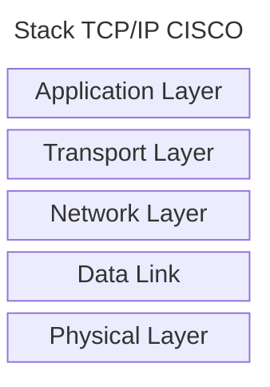
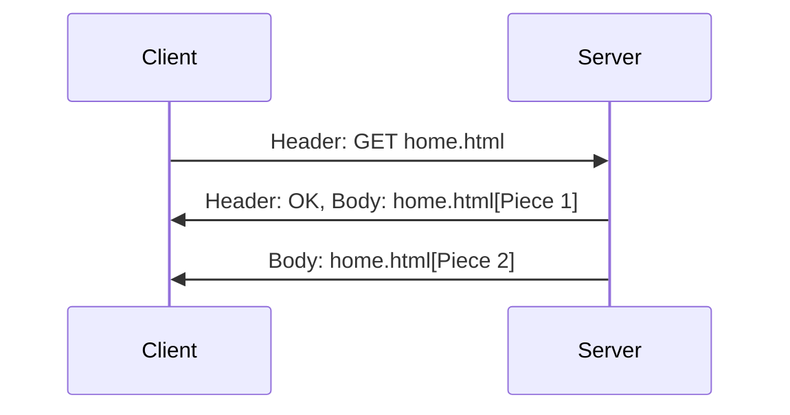
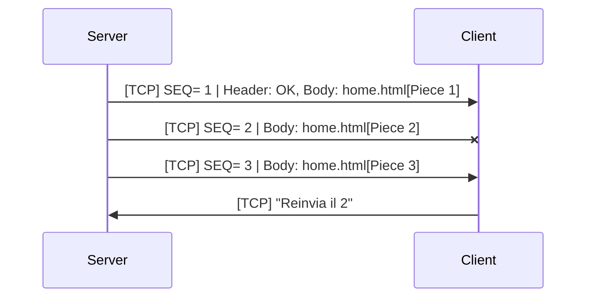
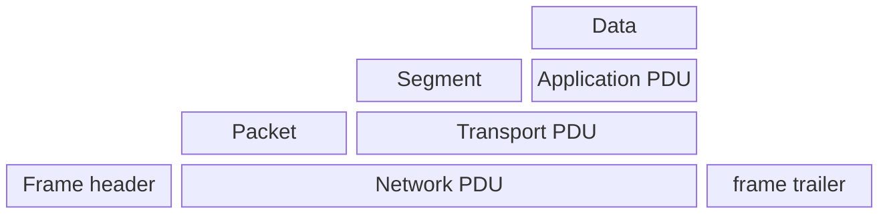
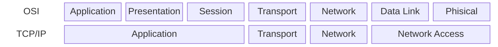

# TCP/IP Networking Model
Per la comunicazione tra i computer oggi si usa un modello standard chiamato
TCP/IP, ma un tempo ogni compagnia aveva il proprio modello e i dispositivi
appartenenti a quella specificia compagnia potevano comunicare solo con 
dispositivi della uscenti dalla stessa compagnia, poiché le altre facevano
uso di un altro modello proprietario e di protocolli propri per comunicare
tra loro.

All'inizio degli anni '70, **L'International Organizzation for Standarditation(ISO)**
creò uno standard ciamato **Open System InterconnectionI(OSI)**, in modo da 
permettere la comunicazione tra diversi device in tutto il mondo.

Anche il Dipartimento della Difesa Americano(DoD) aveva cercato di creare un
modello che potesse permette la comunicazione di device prodotti da compagnie
differenti, ma il loro lavoro fu meno formale di quello scolto per OSI, dando la
vita al **TCP/IP**, che divenne la scelta piu' gettonata, in quanto la sua uscita
fu anche in anticipo rispetto a quella di OSI: quando si parla di OSI si parla,
per questo motivo, di **standard de jure**, mentre il TCP/IP divenne lo 
**standard de facto**.  
I modelli di networking proprietari continuano a esistere ancora oggi, ma la
maggiorparte sono stati sostituiti da TCP/IP.

TCP/IP definisce un grande quantitativo di protocolli e per farlo usa dei 
documenti chiamati **Request For Comments(RFC)**, tranquillamente reperibili
anche online.  
Tuttavia si scelse di non ripetere il lavoro che era gia' stato fatto da altri:
hanno deciso quindi di utilizzare degli standard rilasciati da altre compagnie,
come per essempio **l'Ethernet LAN** definito **dall'Istitute of Eletrical and
Electronic Engineers(IEEE)** e quindi non documentato da un RFC.

Il modello **TCP/IP** separa le proprie funzioni in dei blocchi chiamati **layer**(livelli in Italiano), di quale parte viene implementata anche nei sistemi operativi che usiamo tutti i giorni.

Vediamo qui un esempio di **stack TCP/IP**, ovvero tutti i layer del modello. In realtà per lo scopo del corso, lo stack si compone di 5 layer, che non corrisponde propriamente allo stack TCP/IP reale, che unisce il livello fisico e il data link in quello che si definisce **Network Access Layer**.

Anche **CISCO Packet Tracer**, il software per simulare le reti che sfrutteremo in futuro, fa uso di questo stack TCP/IP esteso.

### Application Layer

E' il layer più in alto dello stack e i suoi protocolli sono moltissimi e, quindi, il suo funzionamento dipende moltissimo da quello che se ne vuole fare.

Esempi di protocolli dell'Application Layer sono **POP3**, **SMTP** e **HTTP**. Quest'ultimo è quello che viene usato, ad esempio, per la visualizzazione delle pagine web e il funzionamento, a grandi linee, è quello che segue:

Il funzionamento è abbastanza intuitivo: un client, come potrebbe essere il web browser, manda un messaggio(**request**) al server chiedendo di mandargli la pagina home.html. Il server risponde con una **respond** in cui è contenuto nell'header lo **status code**, ovvero un codice che definisce se è andato tutto correttamente.

Lo status code associato all'OK, quindi tutto riuscito bene, è il 200, mentre, ad esempio, c'è anche il **Not Found** con lo status code **404** che indica che una specifica risorsa richiesta, come può essere una pagina web, non è stata trovata.

La pagina viene inoltre divisa in più segmenti e viene inviata in più messaggi, ma dal secondo messaggio in poi, lo status code viene omesso per alleggerire quanto più possibile il pacchetto.

### Transport Layer

Al di sotto dell'application layer troviamo il **transport layer**, che ha un numero molto limitato di protocolli e i più usati sono solamente due: **TCP(Trasmission Control Protocol)** e **UDP(User Datagram Protocol)**.

Ogni protocollo offre un servizio al protocollo soprastante e uno di quelli offerti dal transport layer è quello di **error-recovery**: permette quindi di riconoscere se è avvenuto qualche errore nella comunicazione tra due host mediante il concetto di **acknowledgments**.

Per fornire questo servizio, TCP usa un **numero di sequenza(SEQ)** che indica l'ordine con cui devono essere inviati i pacchetti e se ci si accorge che manca un pacchetto, come in questo caso in cui il pacchetto con sequenza pari a 2, viene perso, allora chi riceve i pacchetti può rendersene conto e richiedere nuovamente il pacchetto che è andato perso per qualsiasi ragione.

### Network Layer

Anche il network layer ha un numero molto limitato di protocolli e il più usato è **l'Internet Protocol(IP)**, definito **nell'RFC 791**. Di fatto il modello TCP/IP prende il nome dai sue due protocolli più usati.

L'Internet Protocol implementa due importantissime features che sono **l'indirizzamento**, necessario a identificare univocamente un host all'interno di una rete, e il **routing**, necessario per definire il percorso che devono seguire i pacchetti per raggiungere una specifica destinazione.

**L'indirizzo IP** segue una nomenclatura chiamata **dotted-decimal notation(DDN)** che consiste in 4 numeri separati da dei punti. Ogni numero viene rappresentato da 8 bit e, in quanto tale, in decimale vanno da 0 a 255. Per esempio 192.168.3.2

Gli indirizzi IP possono anche identificare un **gruppo d'indirizzi IP**, vedremo in seguito in che modo.

### Data-Link e Physical Layer

Questi due layer lavorano a stretto contatto tra loro, tanto che alcuni standard definiscono le funzionalità sia del Data-Link che del Physical Layer.

Quando si parla di IP Address a cui mandare un pacchetto, indica il destinatario finale che deve essere raggiunto, ma quando si parla del prossimo host da raggiungere, il **next hop**, questo viene identificato da un codice chiamato **MAC Address**, che identifica nello specifico una scheda di rete, che viene definito dall'IEEE **802.3** e **802.11** per le reti wireless.

Questo è la struttura di un pacchetto al Layer 2. Ottiene il pacchetto dal network layer e gli aggiunge un **header** all'inizio e un **trailer** alla fine: questo è l'unico layer in cui viene aggiunto anche il trailer. Per tutti gli altri layer, ognuno aggiunge il proprio header a quello che gli viene passato dal layer immediatamente sopra e il processo di aggiungere questi header è detto **encapsulation**.

Per ogni layer, i dati che vengono inseriti come header(e trailer per il DataLink) sono detti **Protocol Data Unit(PDU)** in modo generico e si chiamano **data** per l'application layer, **segment** per il transport layer, **packet** per il network layer e **frame** per il data link.

### OSI vs TCP/IP

A questo punto potrebbe sorgere una domanda spontanea: se ad essere usato è il TCP/IP, per quale motivo si parla comunque dell'OSI? Banalmente, per la terminologia.

Di seguito si ripota le differenze tra il modello OSI e il TCP/IP

L'OSI divide l'Application layer in **Application**, **Presentation** e **Session** layer che si occupano rispettivamente di fornire un'interfaccia all'utente, di gestire il formato dei dati e la crittografia e di gestire le connessioni logiche con altri host.

